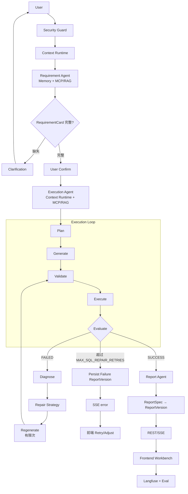

# Agent Flow（Agent 职责与主链路契约）

> 状态: 冻结（P1，2026-08-26）— 目标契约。当前实现差距见「现状映射」节与各 Phase plan。
> 上游: [2026-08-25-refactor-master-freeze.md](../plans/2026-08-25-refactor-master-freeze.md) §一 / §三 / §四。

## 一、最终定位

**ReportAgent = Stateful Agentic Data Analysis Workbench**

```text
自然语言 → 需求理解 → 需求补全/确认 → Schema/Knowledge Retrieval
→ Query Planning → SQL Generation → SQL Validation → SQL Execution
→ Execution Feedback / Repair → Report Planning → Report Version
→ Frontend Workbench
```

| Agent 负责 | Deterministic Runtime 负责 |
|---|---|
| 理解、决策、Tool Selection、Planning、Clarification、Diagnosis、Repair、Report Planning | Security、Authorization、SQL Parsing/Safety、EXPLAIN、DB Execution、Persistence、Row Limit、Report Rendering |

项目性质约束：这是**个人面试项目**，目标是展示 Agent Engineering 能力，不是生产商用平台。

## 二、核心设计原则（冻结）

```text
Agentic where uncertainty exists.
Deterministic where correctness matters.
```

## 三、Agent ≠ Workflow

Workflow 负责确定性流程、状态传递、生命周期、边界、错误传播；Agent 负责理解、决策、Tool Selection、Planning、Repair：

```text
Requirement Workflow：生命周期 / 边界 / 错误传播
  └── Requirement Agent：是否澄清？是否调 Tool？产出 RequirementCard

Execution Workflow：Plan → Generate → Validate → Execute → Evaluate（确定性骨架）
  └── Execution Agent：retrieve? generate? execute? repair? finish?（动态决策）
```

骨架是 Workflow，岔路口的决策是 Agent——以此避免「整个系统其实只是一个固定 DAG，不算 Agent」的质疑。

## 四、Canonical Flow（唯一主链路）



## 五、Agent 职责（三个核心智能阶段）

### Requirement Agent

理解意图、识别 metric/dimension/filter/time_range、决定是否 Retrieval、决定调用哪个 MCP Tool、判断缺失信息、决定 Clarification、生成 RequirementCard。
**不做**：SQL 生成、执行、渲染、持久化。

### Execution Agent（核心）

主循环 `Plan → Retrieve → Generate → Validate → Execute → Evaluate`。
失败路径必须走 `Error Classification → Diagnose → Repair Strategy → Regenerate`，把以下六要素传入 Repair——**禁止 blind retry**：

```text
Original Requirement / Current Schema / Previous SQL /
Failure Category / Error Message / Validation Result / Retry Count
```

上限：达到 `MAX_SQL_REPAIR_RETRIES` 后 Persist Failure ReportVersion → SSE error → 前端 Retry/Adjust，不无限循环。

### Report Agent

`Execution Result → ReportSpec → ReportVersion → Frontend Renderer`。ReportSpec 至少支持 title/summary/insight/kpi/chart/table/section/recommendation/alert。
**数据真实性原则：所有数值、排名、统计、图表数据必须来自实际 Query Result，禁止编造数字/指标/字段/修改 SQL 结果。**

## 六、现状映射（截至 P1）

| 契约要素 | 现状 | 差距归属 Phase |
|---|---|---|
| Requirement Agent + Workflow | `backend/app/agent/requirement_analysis_graph.py` 在位；只暴露 schema 工具（SQL gate 由 `tests/graphs/test_requirement_analysis_sqlgate.py` 钉住） | 目录迁至 `agents/requirement/` 属 P3 |
| Confirmed 执行链 | `backend/app/agent/confirmed_execution_graph.py`：security_guard 入口节点 → gate → 锁 draft → schema → sql_agent → report_agent → persist | 同上 |
| Execution Agent 动态决策环 | 已落地（P8）— `_diagnose` 节点 + `DiagnosePolicy.decide()` 纯确定性策略 + `_route_after_diagnose` 按 `DiagnoseDecision.action` 路由（plan §四 / `docs/plans/2026-08-29-p8-execution-agent-loop.md`） | — |
| Repair 六要素上下文 | 部分：rejected SQL + error message 已回灌 prompt | P8 结构化 |
| `MAX_SQL_REPAIR_RETRIES` 预算 | 重试计数散装（retry_counters） | P9 统一预算 |
| Legacy 链路 | `backend/app/legacy/agents/parent_graph.py`（仅 mode=legacy），import freeze 断言钉住 | P15 删除 |
