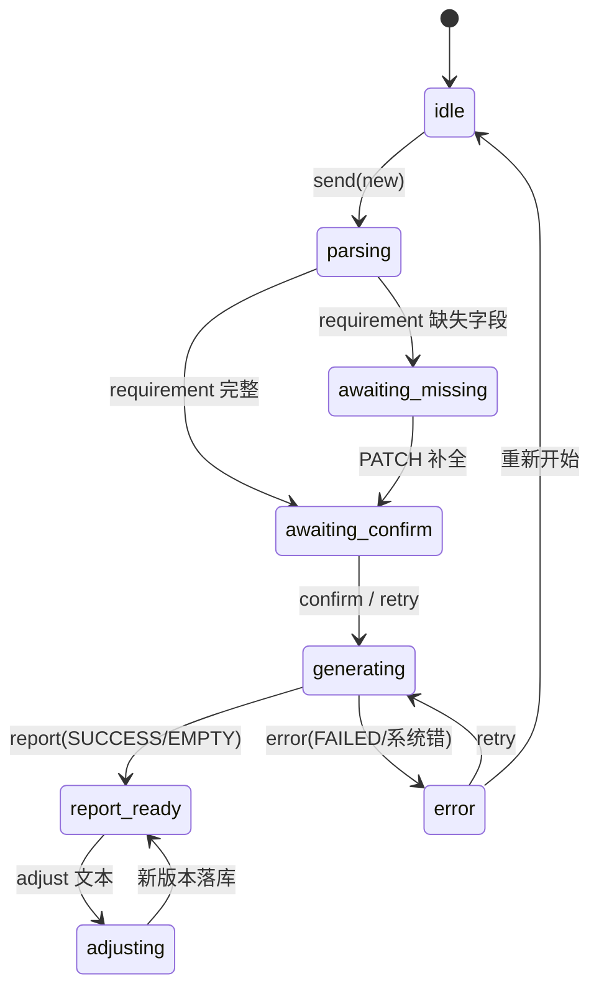

# Frontend Contract（前端与 SSE 事件契约）

> 状态: 冻结（P1，2026-08-26）— 目标契约。当前实现差距见「现状映射」节与各 Phase plan。
> 上游: [2026-08-25-refactor-master-freeze.md](../plans/2026-08-25-refactor-master-freeze.md) §十六。

## 一、一等公民

- **AnalysisPhase 状态机**：



- **`analysisReducer` 是 phase 的唯一写入者**——组件只 dispatch discriminated-union actions，不得直改 store。
- 数据流单向：`Backend State → Application Event → SSE → Frontend Reducer`（不直通内部 state）。
- 报告内容严格渲染自真实 payload，禁止编造 demo 数据。

## 二、Canonical Events（SSE v2 基线 = `docs/sse-v2.md` 现行 7 个）

| 事件 | 载荷要点 |
|---|---|
| `phase` | `{ phase, reason? }` |
| `requirement` | 完整 RequirementCard |
| `trace` | 步骤级执行轨迹 |
| `thinking` | Agent 推理提示（≈ P11 的 `agent.thinking`） |
| `report` | `{ version, parent_version, title, answer, trace }` |
| `error` | `{ code, message, recoverable, failed_action }` |
| `done` | `{ final_phase }` |

**P11 扩展（扩展，不替换）**：progress 事件族——`agent.started / agent.completed / agent.failed`、`tool.started / tool.completed`、`sql.generated / sql.executed`、`repair.started / repair.completed`、`report.generated / report.updated`。其中 `agent.thinking ≈ 现 thinking`；`tool.* / sql.* / repair.*` 由 `trace` 载荷细化。前端只消费公开事件契约，不猜 backend 内部 state。

## 三、ReportVersion 一级 Domain Object

两组状态区分，不合并：

```text
ReportVersion 生命周期：GENERATING / DONE / ERROR
Query Result 三态：     SUCCESS / EMPTY / FAILED
```

ReportPaper 对 EMPTY 渲染「未找到匹配记录」带、对 FAILED 按 `error_kind` 分支展示——不做假表。

**V1 能力范围**：创建 / 查看 / 切换 / 继续调整 / 重新生成（已有能力，强化即可）。version diff / favorite / delete / compare 属 V2，非当前技术含金量核心。

## 四、现状映射（截至 P1）

| 契约要素 | 现状 | 差距归属 Phase |
|---|---|---|
| Phase 状态机 + reducer 单写者 | `frontend/src/stores/analysisReducer.ts` + `api/confirmStream.ts` 在位 | P11 事件面整理基座 |
| 七事件基线 | 已实现（`analysisClient.ts` + sse 解析） | — |
| progress 事件族 | 未实现 | P11 |
| ReportVersion UI | 创建/查看/切换/调整/重新生成已有 | 强化属 P10/P11 |
| 后台执行轮询 | SSE 解耦独立任务 + 前端 5s 轮询通知（execution-background-run） | 保留 |
